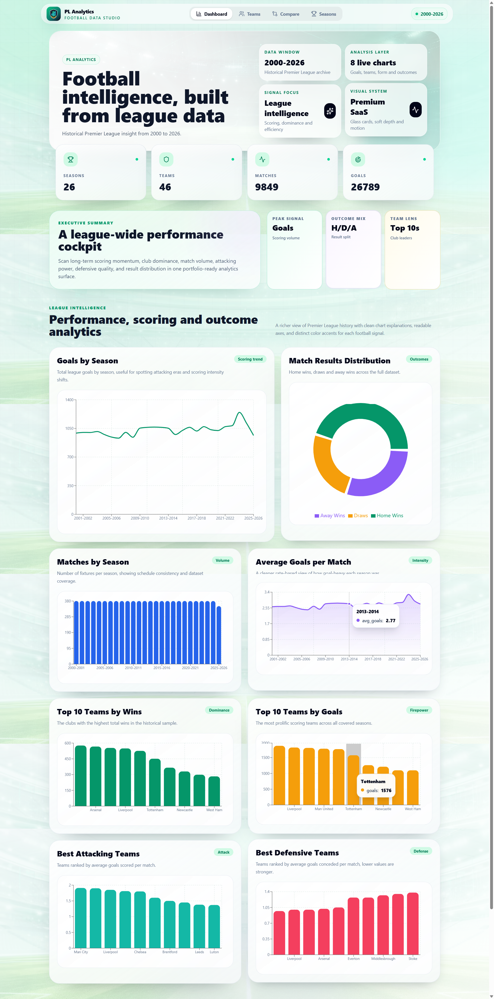
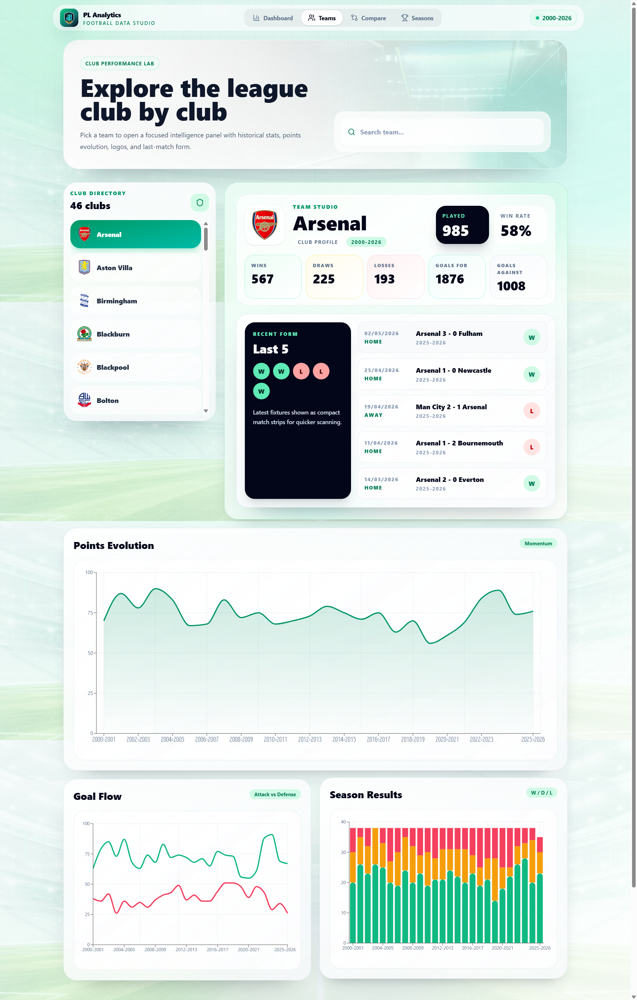
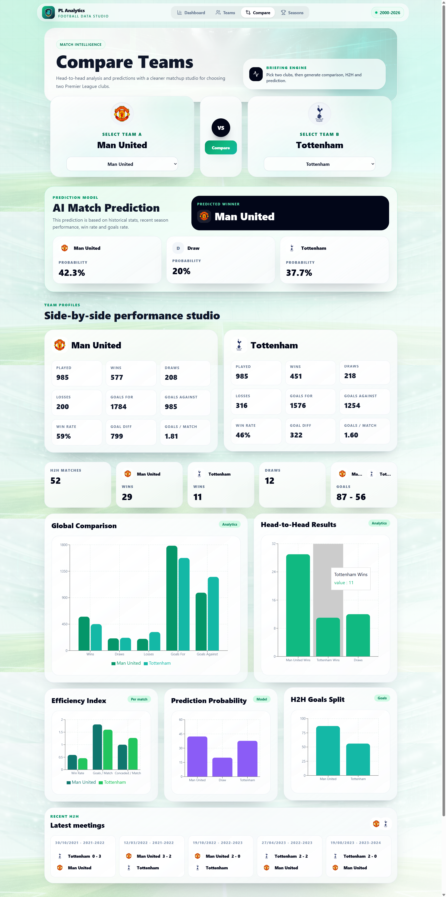
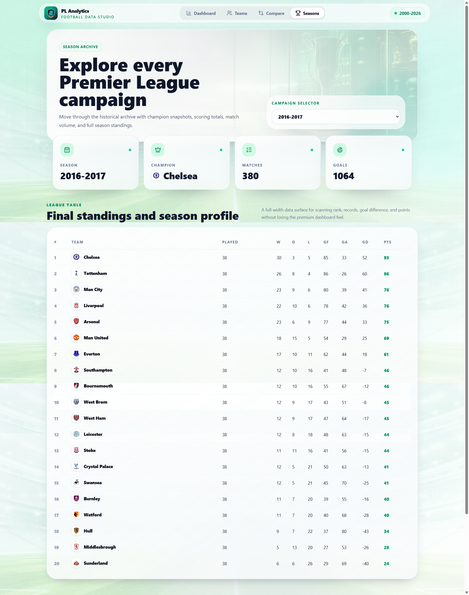

# ⚽ PL Analytics — Premier League Football Data Studio

A modern full-stack football analytics platform built to explore and visualize Premier League historical data from 2000 to 2026.

## 🌍 Live Demo
🔗 Live App: https://premier-league-analytics-sigma.vercel.app

## 📂 GitHub Repository
🔗 Source Code: https://github.com/aymane-gouhmid/premier-league-analytics

---

# 🚀 Features

## 📊 Dashboard Analytics
- League-wide statistics
- Goals by season
- Match result distributions
- Average goals per match
- Top winning teams
- Best attacking & defensive teams
- Interactive charts and visual insights

## 🏟 Teams Analytics
- Club historical statistics
- Points evolution analysis
- Goal flow visualization
- Season results charts
- Last matches form tracking
- Win rate and performance metrics

## ⚔️ Compare Teams
- Side-by-side club comparison
- Head-to-head statistics
- AI-inspired match prediction
- Probability visualization
- Historical H2H insights
- Efficiency and scoring analytics

## 🏆 Seasons Archive
- Historical season exploration
- Final standings tables
- Champion tracking
- Season statistics overview
- Match and goals summaries

---

# 🛠 Tech Stack

## Frontend
- React.js
- Vite
- Tailwind CSS
- Axios
- Recharts

## Backend
- FastAPI
- Pandas
- NumPy
- Uvicorn

## Deployment
- Frontend → Vercel
- Backend → Render

---

# 📈 Data Source

Historical Premier League datasets covering seasons from 2000 to 2026.

---

# ⚡ Performance Optimizations

- Backend CSV caching using 'lru_cache'
- FastAPI startup preloading
- Optimized API structure
- Lazy loading and reusable components

---

# 🎨 UI/UX Highlights

- Modern SaaS-inspired dashboard
- Glassmorphism design
- Responsive layouts
- Interactive charts
- Smooth transitions & animations
- Premium football analytics interface

---

# 📸 Screenshots

## Dashboard
Modern analytics cockpit with league-wide statistics and visual charts.

---
## Teams Studio
Club performance analysis with evolution graphs and recent form tracking.

---
## Compare Mode
Advanced team comparison with prediction engine and head-to-head analytics.

---
## Seasons Archive
Historical Premier League standings and campaign explorer.

---

# 🧠 Future Improvements

- Real machine learning prediction model
- Player analytics
- xG metrics
- Live match integration
- Authentication system
- Dark mode
- Export reports
- Real-time statistics

---

# 👨‍💻 Author

## Aymane Gouhmid
Data Science Student

- LinkedIn: https://www.linkedin.com/in/aymane-gouhmid-919bb3347/
- GitHub: https://github.com/aymane-gouhmid

---

# ⭐ Support

If you like this project, feel free to:
- Star the repository
- Share feedback
- Connect on LinkedIn
